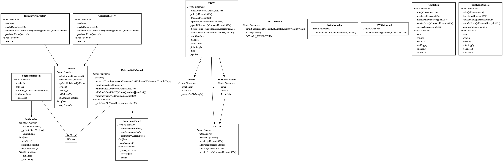

# **Contracts Boilerplate**

**Author**: [Naumov Viacheslav](https://github.com/0xSlaweekq)

## **Project Overview**

The `Contracts Boilerplate` is a comprehensive framework designed to simplify
the development, testing, and deployment of smart contracts across multiple
blockchain networks, including Ethereum, Binance Smart Chain (BSC), and Tron. It
offers a modular, scalable, and secure foundation for building decentralized
applications (dApps) with advanced contract management features.

This boilerplate is tailored for developers and teams working on projects that
require robust handling of token transfers, proxy-based contract upgrades,
deterministic contract address generation, and seamless multi-chain
compatibility.

## **Key Features**

1. **Universal Withdrawals**: The framework supports both Ether (ETH) and ERC20
   token withdrawals, including single transfers and batch operations. Its
   flexible architecture ensures seamless handling of complex withdrawal
   scenarios, including factory-initiated withdrawals and mass transfers.

2. **Proxy Architecture**: Using an upgradeable proxy design, the project
   enables the deployment of contracts that can be updated without changing
   their addresses. This ensures backward compatibility while maintaining
   flexibility for future enhancements.

3. **Clone Management**: The boilerplate leverages the `Clones` library
   (OpenZeppelin) to create lightweight, cost-efficient contract clones. It
   incorporates `CREATE2` for deterministic address generation, simplifying
   contract lifecycle management.

4. **Tron Integration**: The project includes full support for the Tron
   blockchain, enabling proxy interactions, encoding/decoding of Tron-specific
   data, and deployment of Tron-compatible contracts.

5. **Error Handling and Logging**: Comprehensive error definitions and event
   logging mechanisms ensure transparency, traceability, and efficient debugging
   for all contract operations.

## **Why Use This Boilerplate?**

1. **Multi-Chain Compatibility**: The framework is designed to operate
   seamlessly across Ethereum, BSC, and Tron networks, enabling developers to
   build cross-platform solutions.

2. **Scalability**: Its modular design and support for contract cloning allow
   for efficient scaling of decentralized applications.

3. **Security**: The use of established patterns, such as upgradeable proxies
   and the `CREATE2` mechanism, ensures a high level of security for contract
   deployments.

4. **Developer-Friendly**: With features like ABI generation, automated testing,
   and comprehensive tooling, the boilerplate streamlines the development
   process for both novice and experienced developers.

5. **Flexibility**: The framework supports a wide range of use cases, from basic
   token transfers to complex factory-managed workflows.

## **Getting Started**

This repository includes everything needed to develop, test, and deploy
contracts:

- Source contracts written in Solidity.
- Scripts for deployment and testing.
- Configuration for multi-chain compatibility.
- Tools for ABI generation and gas optimization.

For detailed instructions on setting up the project and deploying contracts,
please refer to the `Getting Started` guide in the documentation.

Read more about contracts in:

**Contracts:**

- [TronUniversalFactory](contracts/common/TronUniversalFactory.sol)
- For contract [UniversalFactory](contracts/common/UniversalFactory.sol) read
  [this](docs/UniversalFactory.md)
- For contract [UniversalWithdrawal](contracts/common/UniversalWithdrawal.sol)
  read [this](docs/UniversalWithdrawal.md)
- For contract [UpgradeableProxy](contracts/common/UpgradeableProxy.sol) read
  [this](docs/UpgradeableProxy.md)

    **Utils:**

- For contract [Admin](contracts/utils/Admin.sol) read [this](docs/Admin.md)
- For interface [IEvents](contracts/utils/IEvents.sol) read
  [this](docs/IEvents.md)
- For library [LibAdmin](contracts/utils/LibAdmin.sol) read
  [this](docs/LibAdmin.md)
- For library [LibErrors](contracts/utils/LibErrors.sol) read
  [this](docs/LibErrors.md) -[TronClones](contracts/utils/TronClones.sol)

---

## Inheritance Graph



---

## **Use Cases**

1. **Decentralized Finance (DeFi)**:
    - Token swaps, staking, and yield farming with robust withdrawal mechanisms.
2. **Gaming and NFTs**:
    - Efficient deployment of contract clones for managing in-game assets or
      NFTs.
3. **Multi-Chain Applications**:
    - Building dApps that interact with multiple blockchain networks.

## **Contact and Support**

For any questions, feature requests, or bug reports, please open an issue in
this repository or reach out to the maintainers.

## Installation

```bash
$ nvm use && npm ci
```

## Before all: compile

```bash
npm run compile
```

# **Scripts Description**

- **`auto-test`**: Runs static analysis with `slither` to detect vulnerabilities
  in contracts.
- **`clean`**: Removes compiled artifacts and cache files.
- **`compile`**: Compiles contracts for Ethereum, BSC, and Tron networks.
- **`coverage`**: Generates test coverage reports for Solidity contracts.
- **`format`**: Formats code (TypeScript, JavaScript, JSON, Solidity) using
  Prettier.
- **`gen-abi`**: Compiles contracts, generates ABI files, and formats them.
- **`lint`**: Fixes lint issues in TypeScript and JavaScript files with ESLint.
- **`lint:sol`**: Lints Solidity contracts using Solhint.
- **`ln`**: Starts a local Docker environment for testing.
- **`ln-reboot`**: Restarts the local Docker environment.
- **`ln-stop`**: Stops and removes the local Docker environment.
- **`prepare`**: Installs Git hooks with Husky.
- **`pretty-quick`**: Formats staged files before committing.
- **`release`**: Creates a new release version with changelog updates.
- **`s:contract-summary`**: Generates a summary of contracts using Slither.
- **`s:function-summar`**: Generates a function summary of contracts using
  Slither.
- **`s:human-summary`**: Generates a human-readable summary of contracts using
  Slither.
- **`s:inheritance-graph`**: Generates an inheritance graph for contracts,
  converts it to a PNG image using `dot`, and removes the temporary DOT file.
- **`summary`**: Generates a checklist of contracts and outputs it to
  `ContractsSummary.md`.
- **`test`**: Executes unit tests using Hardhat.
- **`test:bsc`**: Runs tests on a local Binance Smart Chain network.
- **`test:eth`**: Runs tests on a local Ethereum network.
- **`test:tron`**: Runs tests on the Tron test network.

## ETH/BSC

## Deploy withdrawal contract

1. Deploy contract

```bash
npx hardhat deploy:universal_withdrawal --network bscTestnet
```

2. Output will be like this, copy this address

```
UniversalWithdrawal deployed to: 0x39B6c9ece042d4E60ca6680d95f160F0B095b6e3
UniversalFactory deployed to: 0xd805a9C73c3CC065a2566ab78a1e01BA57d982B2
```

3. (optional) Verify contract on etherscan

If don't auto verified

```
npx hardhat verify --network bscTestnet  0xd805a9C73c3CC065a2566ab78a1e01BA57d982B2 --show-stack-traces
```

## Deploy factory contract

1. Deploy

```bash
npx hardhat deploy:universal_factory --net tronTest --withdrawal <withdrawal_contract_address>
```

## Deploy withdrawal and factory contracts

1. Deploy contract

```bash
npx hardhat deploy:universal_factory --network bscTestnet
```

2. Output will be like this, copy this address

```
UniversalWithdrawal deployed to: 0x39B6c9ece042d4E60ca6680d95f160F0B095b6e3
UniversalFactory deployed to: 0xd805a9C73c3CC065a2566ab78a1e01BA57d982B2
```

# TRON

## Deploy withdrawal contract

1. Deploy factory contract

```bash
npx hardhat deploy:tron_universal_withdrawal --net nile
```

2. Output will be like this, mem this address

```
Owner: TMVQGm1qAQYVdetCeGRRkTWYYrLXuHK2HC
UniversalWithdrawal deployed to TT6PeUK1ra3tc4pb98DLbr3ndQqDwAPRvF
```

## Deploy factory contract

1. Deploy

```bash
npx hardhat deploy:tron_universal_factory --net tronTest --withdrawal <withdrawal_contract_address>
```

## Deploy withdrawal and factory contract

1. Deploy

```bash
npx hardhat deploy:tron_universal_factory --net tronTest
```

1. Output will be like this, mem this address

```
Owner: TMVQGm1qAQYVdetCeGRRkTWYYrLXuHK2HC
Account balance: 98999829070930510
UniversalWithdrawal deployed to THPufgkTXv5wxBTzVnr2zkohygw7TaD41M
TronUniversalFactory deployed to TCXJeGtjvAcp1JDAVeZmu5n1gZQcaxSEdv
```

- Note that tronweb and tronscan won`t show abi of cloned contract and if you
  want call this contract, you need to do it manually, see
  utils/get-balance-clone.js
- prof of contract work: utils/withdraw-from-clone.js

## Tests

To run only 1 test, all unnecessary ones must be commented out by adding “x” at
the beginning, example: describe -> xdescribe

### Commands for testing

- For start your local node

```bash
npm run ln # for start node
npm run ln-stop # for stop node
npm run ln-reboot # for reboot node
```

- for all networks

```bash
npm run test --network <network> <path_to_test_file>
```

- with test networks

```bash
npm run test:bsc
npm run test:eth
npm run test:tron
```

- Run all tests for contracts in BSC, ETH and TRON networks

```bash
npm run test:bsc test/deploy-bsc.test.ts # all tests for bsc
npm run test:eth test/deploy-eth.test.ts # all tests for eth
npm run test:tron test/deploy-tron.test.ts # all tests for tron

npm run test:bsc test/bsc-stress.test.ts # stress tests for bsc
npm run test:eth test/eth-stress.test.ts # stress tests for eth
npm run test:tron test/tron-stress.test.ts # stress tests for tron
```

```bash
# To check on the testnet, you must first replace mnemonic with your own in .env and have a balance of at least 1 tBNB
MNEMONIC="test test test test test test test test test test test junk"

npm run test:bscTestnet # tests for testnet bsc(97)

```
